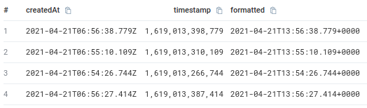
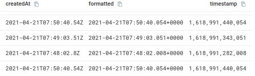
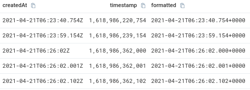

Sumo Logic's [```parseDate(strDate>, <dateFormat>, <timeZone>)```](https://help.sumologic.com/05Search/Search-Query-Language/01-Parse-Operators/parseDate) operator allows queries to extract a timestamp in milliseconds from a string.  The operator functions in a fairly straight forward way, by using a dateFormat parameter (based on Java's [SimpleDateFormat](https://docs.oracle.com/javase/7/docs/api/java/text/SimpleDateFormat.html))

<!--truncate-->

**A quick example of querying some Amazon ECS data.**

```sumologic_query
event_source="aws.ecs"
| json "detail" | json field=detail "createdAt" | fields createdAt
| parseDate(createdAt, "yyyy-MM-dd'T'HH:mm:ss.SSS'Z'") as timestamp
| formatDate(timestamp, "yyyy-MM-dd'T'HH:mm:ss.SSSZ") as formatted
```

That gives me some data.



**Initial Observations**

- The `createdAt` values end with `Z`, which can only be parsed using a `'Z'` format string, since `Z` itself does not properly parse it.  Had this query used an unquoted `Z`, Sumo Logic would have returned an error such as: `Unparseable date: "2021-04-21T06:45:00.082Z"`
- By using a quoted `Z`, Sumo Logic was unable to detect that this is indeed a UTC date, and since it wasn't specified, the timezone was lost in translation.

**The query after adding the timezone.**

```sumologic_query
event_source="aws.ecs"
| json "detail" | json field=detail "createdAt" | fields createdAt
| parseDate(createdAt, "yyyy-MM-dd'T'HH:mm:ss.SSS'Z'", "etc/Utc") as timestamp
| formatDate(timestamp, "yyyy-MM-dd'T'HH:mm:ss.SSSZ") as formatted
```

And that addresses the timezone issue.



Note that when the milliseconds are less than 100, the dates end up actually shorter, but the information is still translated correctly.  With this date format 8 in this case = 008 not 800, which might be confusing, but is actually working as intended.

But AWS unfortunately doesn't stop with the truncation there, throwing a new curve ball to parseDate.

**When milliseconds equal 0, they are omitted**

```sumologic_query
event_source="aws.ecs"
| json "detail" | json field=detail "createdAt" | fields createdAt
| parseDate(createdAt, "yyyy-MM-dd'T'HH:mm:ss.SSS'Z'", "etc/Utc") as timestamp
| formatDate(timestamp, "yyyy-MM-dd'T'HH:mm:ss.SSSZ") as formatted
| where !(createdAt contains ".")
```

Here we are specifically looking for dates, where milliseconds are missing completely.  This leads us to another error: `Unparseable date: "2021-04-21T06:26:02Z"`.

This behavior seems inconsistent depending on where in the data this exception occurs.  In larger queries, you'll sometimes see many rows returned, and this error pops up, giving no indication that the results got truncated.

**The only fix I've found to this so far, seems to be fixing the date.**

```sumologic_query
event_source="aws.ecs"
| json "detail" | json field=detail "createdAt" | fields createdAt
| parseDate(
    replace(createdAt, /:(\d\d)Z/, ":$1.0Z")
    , "yyyy-MM-dd'T'HH:mm:ss.SSS'Z'"
    , "etc/Utc"
  ) as timestamp
| formatDate(timestamp, "yyyy-MM-dd'T'HH:mm:ss.SSSZ") as formatted
```



The `replace(createdAt, /:(\d\d)Z/, ":$1.0Z")` in this query, adds in the missing date part when needed.  This likely creates some load on the query, but at least it addresses the parsing problem.

**One more word of warning about NULL**

If the date value ends up being a NULL, you will get very inconsistent results or errors.

```sumologic_query
event_source="aws.ecs"
| json "detail" | json field=detail "startedAt" nodrop | fields startedAt
| where isnull(startedAt)
| parseDate(startedAt, "yyyy-MM-dd'T'HH:mm:ss.SSS'Z'", "etc/Utc") as timestamp
| formatDate(timestamp, "yyyy-MM-dd'T'HH:mm:ss.SSSZ") as formatted
```

This query is intentionally setup to fail and will return an error: `The following errors were reported when executing your search: Oops! Looks like we encountered a problem. Try running your query again. If the problem persists, please contact Support. [Error Code: 00000-00000-00000] (500)`

The workaround here is to either make sure your query never encounters NULL values, or to have it use a valid replacement date.  In my case, I opted for an alternate date, but you really need to be sure about that date if you use that workaround.

```sumologic_query
event_source="aws.ecs"
| json "detail" | json field=detail "startedAt", "createdAt" nodrop
| where isnull(startedAt)
| isNull(startedAt) ? createdAt : startedAt as startedAt
| parseDate(startedAt, "yyyy-MM-dd'T'HH:mm:ss.SSS'Z'", "etc/Utc") as timestamp
| formatDate(timestamp, "yyyy-MM-dd'T'HH:mm:ss.SSSZ") as formatted
```

