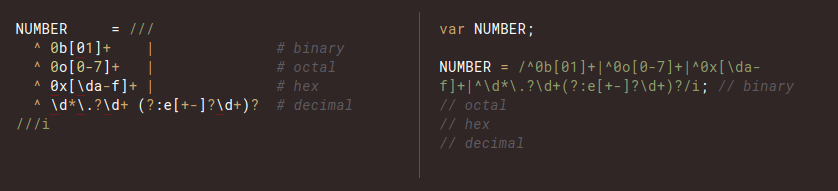

**Regular Expressions are great, but not easy to look at!**

Let's take for example a regular expression in Javascript for parsing an email adddress.

```javascript
^(([^<>()\[\]\\.,;:\s@"]+(\.[^<>()\[\]\\.,;:\s@"]+)*)|(".+"))@((\[[0-9]{1,3}\.[0-9]{1,3}\.[0-9]{1,3}\.[0-9]{1,3}])|(([a-zA-Z\-0-9]+\.)+[a-zA-Z]{2,}))$
```

To a trained eye this is likely as least readable enough, that they can guess that this parses an email address.  But most people I work with, and myself included aren't going to be able to tell if there are any obvious bugs in this.

<!--truncate-->

**Coffeescript did something really well**

While Coffeescript is frequently greeted with a grunt and moan around the people I know, it actually did many things better than javascript, before ES6 and all the new toys in JS started showing up a few years ago.

It allowed regular expressions to be broken up over multiple lines, AND it allowed comments.  Take a look at the example from their docs.



Now it does come with a downside, and that is that it handles spaces in the regular expression special, which made some regular expressions hard to work with.  But it was still a lot better than the example above.

**Javascript can actually do this too (with a tiny bit of reusable code)**

This example illustrates how to do this, by creating and using a method called `multilineRegex`, to make a new `RegExp` for parsing an AWS secret ARN.

```javascript
const multilineRegex = (...parts) =>
  new RegExp(parts.map(x => (x instanceof RegExp) ? x.source : x).join(''));

// a variable I want to use as part of the regular expression
const partition = "aws-cn";

const re = multilineRegex(
  /aws:/, // I can COMMENT!!!!
  partition,  // this is being pased in as a variable
  /:secretsmanager:cn-north-1:111111111111:/
);

console.log({
  a: re.test('aws:aws:secretsmanager:cn-north-1:111111111111:'),
  b: re.test('aws:aws-cn:secretsmanager:cn-north-1:111111111111:')
});
```

The `RegExp` object in Javascript has an often neglected property called `source`, which returns the string version of a regular expression.  What the `multilineRegex` method does, is loop through all the parameters passed into it, and combines them into a long regex string, which is then used to create a new `RegExp` object.  

Since `multilineRegex` is a method call, it can have each part broken up over multiple lines, and that naturally allows it to also have comments.

