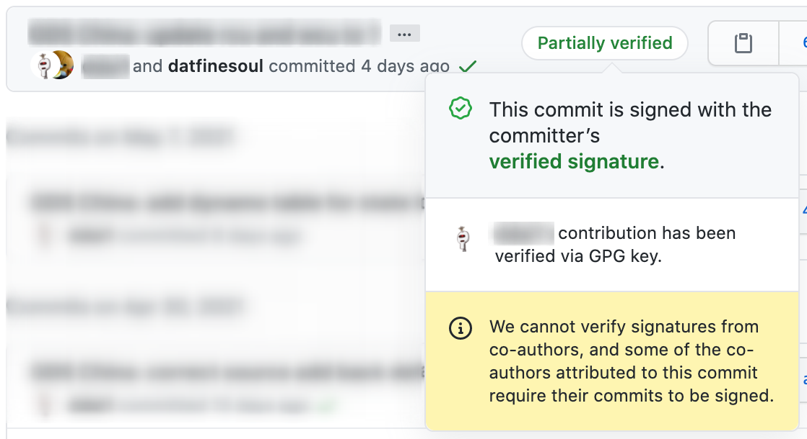

## GIT Co-Authors 

[GitHub](https://docs.github.com/en/github/committing-changes-to-your-project/creating-a-commit-with-multiple-authors#creating-co-authored-commits-on-github) and [GitLab](https://gitlab.com/gitlab-org/gitlab-foss/-/merge_requests/17919) both support the idea of co-authors which allow a user to attribute a commit to more than one author by adding one or more `Co-authored-by` trailers to the commit's message.

Co-author attibuting looks somethink like the following in the commit message.

```text
Co-authored-by: name <name@example.com>
Co-authored-by: another-name <another-name@example.com>
```

So at the time of the commit, it requires that the author has the proper email address of the user they are trying to add as a co-author.

When this commit is pushed to the GitHub/GitLab repo, you'll see the co-authored commit showing up, looking something like this.



Here are some things to note about the picture above.

1. You can see the two author icons at the top, saying that the commit was done by multiple users.

2. The is also a not that the commit is *partially verified*.  This is due to:

   - The primary author having GIT setup to sign his commits using his own GPG private key and GitHub confirming his signed commit.

   - The secondary author also has GitHub setup to require his commits to be signed and verified
   - The primary author does not have access to the secondary author's GPG private key, so he's only able to attribute the commit, but not have GitHub verify it.

## Methods for adding Co-Authors

### Manually add it to the commit

The most error prone and labor intensive version of this.  This requires the user to have the email address of the secondary author, and would mean that in every commit, he has to enter the proper co-author attribution line.  eg. `Co-authored-by: name <name@example.com>`

I've tried this way a long time ago, and that was just to painful.

### Use the `commit.template` Setting

GIT has a config setting called `commit.template` that can be configured to point at a template file.  This would be set something like this.

```bash
# this would point git at a template for all repos worked on my the current user
git config --global commit.template /home/datfinesoul/.gitmessage
# this would be a repo specific template
git config --local commit.template templates/.gitmessage
```

And the `.gitmessage` file would contain:

```text
# This is a template for all my commits.
# Remove any co-author you don't want to use
Co-authored-by: name1 <name1@example.com>
Co-authored-by: name2 <name2@example.com>
```

Now every time the user commits, the contents of the `.gitmessage` file would be automatically populated into the message of the commit.  The user can then add new co-authors by editing the template or remove co-authors by deleting lines.  Easier than the method before, but still wasn't really ideal for me.

### Automate Co-Authors

