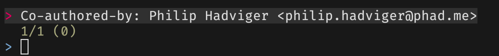
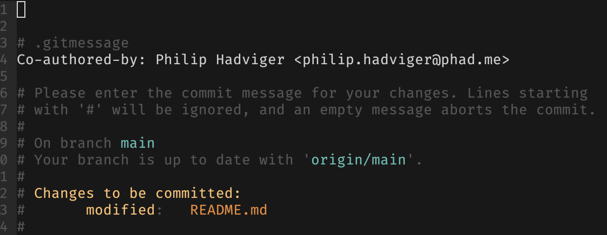

## GIT Co-Authors 

[GitHub](https://docs.github.com/en/github/committing-changes-to-your-project/creating-a-commit-with-multiple-authors#creating-co-authored-commits-on-github) and [GitLab](https://gitlab.com/gitlab-org/gitlab-foss/-/merge_requests/17919) both support the idea of co-authors which allow a user to attribute a commit to more than one author by adding one or more `Co-authored-by` trailers to the commit's message.

Co-author attibuting looks somethink like the following in the commit message.

```text
Co-authored-by: name <name@example.com>
Co-authored-by: another-name <another-name@example.com>
```

<!--truncate-->

So at the time of the commit, it requires that the author has the proper email address of the user they are trying to add as a co-author.

When this commit is pushed to the GitHub/GitLab repo, you'll see the co-authored commit showing up, looking something like this.


Here are some things to note about the picture above.

1. You can see the two author icons at the top, saying that the commit was done by multiple users.

2. The is also a not that the commit is *partially verified*.  This is due to:

   - The primary author having GIT setup to sign his commits using his own GPG private key and GitHub confirming his signed commit.

   - The secondary author also has GitHub setup to require his commits to be signed and verified
   - The primary author does not have access to the secondary author's GPG private key, so he's only able to attribute the commit, but not have GitHub verify it.

## Methods for adding Co-Authors

### Manually add it to the commit

The most error prone and labor intensive version of this.  This requires the user to have the email address of the secondary author, and would mean that in every commit, he has to enter the proper co-author attribution line.  eg. `Co-authored-by: name <name@example.com>`

I've tried this way a long time ago, and that was just to painful.

### Use the `commit.template` Setting

GIT has a config setting called `commit.template` that can be configured to point at a template file.  This would be set something like this.

```bash
# this would point git at a template for all repos worked on my the current user
git config --global commit.template /home/datfinesoul/.gitmessage
# this would be a repo specific template
git config --local commit.template templates/.gitmessage
```

And the `.gitmessage` file would contain:

```text
# This is a template for all my commits.
# Remove any co-author you don't want to use
Co-authored-by: name1 <name1@example.com>
Co-authored-by: name2 <name2@example.com>
```

Now every time the user commits, the contents of the `.gitmessage` file would be automatically populated into the message of the commit.  The user can then add new co-authors by editing the template or remove co-authors by deleting lines.  Easier than the method before, but still wasn't really ideal for me.

### Automate Co-Authors

I wanted to automate the options above to accomplish a few things.

1. I like `commit.template` files, so I wanted to preserve that in my workflow
2. I wanted whatever option to come up with still support all the `git commit` arguments
3. I didn't want to manage the email addresses and user names myself
4. Co-Authors need to be relevant to what I'm working on, even in something like a giant infrastructure monorepo.

I'll explain what I came up with in the comments are more below.

```bash
coauthor () {
local STATUS ROOT_DIR COAUTHORS

# this section is all about figuring out where this command is run
git rev-parse HEAD -- > /dev/null 2>&1
STATUS="$?"
if [[ "${STATUS}" -ne 0 ]]; then
  # Use the regular git command if:
  # - This is not a GIT repo (so that you get normal errors)
  # - This repo has not yet had a commit
  git commit "$@"
  return
fi

# This part happens if we are in a proper repo for using co-authors
# By default, I'm going to look for co-authors related to the current directory and below
ROOT_DIR="."
if [[ "${1:-}" == "--all" ]]; then
  # If the --all option was specified, the co-author filter will start at the repo root
  ROOT_DIR="$(git rev-parse --show-toplevel)"
fi

# The co-authors will first be dumped into a temporary text file
COAUTHORS="$(mktemp /tmp/co-author.XXXXXXXX)"
{
  # Here I'm using the contents of the commmit.template as part of the commit message
  cat "$(git config commit.template)"
  # - Read about git shortlog in detail online, but basically it's a list of all
  # author emails, ordered by number of commits
  # - I filter out my own email using the fgrep -v
  # - I use FZF as a way to select the co-authors (with TAB key)
  git shortlog --summary --numbered --email --all "${ROOT_DIR}" \
    | cut -f2- \
    | awk '$0="Co-authored-by: "$0' \
    | fgrep -v "$(git config user.email)" \
    | fzf --multi --exit-0 --no-sort
} > "${COAUTHORS}"
# I commit using the template that was created as the default gitmessage
git commit --template="${COAUTHORS}" "$@"
}
```

When I run this script, I get a popup looking something like this:



This is a test repo, so not the greatest example, but basically a list shows up and I use TAB to select co-authors, and they get automatically inserted into the git commit message.



## Some more Info about the script

Whenever I was to commit something with co-author attribution, I now use the function.

```bash
# For example, previously.
git commit -a

# With attribution
coauthor -a
# or if I need all authors in the whole repo
coauthor --all -a
```

### Notes

- I've tested this on OSX Catalina and Ubuntu 18.04
- `commit.template` supports `~/` abbreviations for the path, but this script currently requires a full or relative path to the `commit.template` file.
- My actual script has `--gpg-sign` added to the `git commit` inside the script, so I didn't include it in this script, since I figured it was sort of a customization not needed for the example.
- I have my version in a [public GitHub repo](https://github.com/datfinesoul/env-ubuntu/blob/main/functions/coauthor.bash), so if you find bugs or want to give suggestions, please open an issue there.